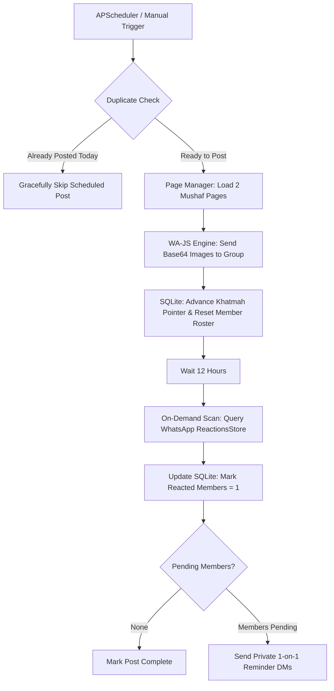

# 📖 Baba Quran (بابا قرآن)

An automated, stateful Python WhatsApp bot designed to manage daily family Quran Khatmah schedules, post high-resolution Madinah Mushaf page images, track member emoji reactions on demand, and dispatch gentle private 12-hour reminder DMs.

---

## 🌟 Key Features

- **Direct WA-JS WhatsApp Web API**: Programmatically sends media and text messages via the internal WhatsApp Web media pipeline (`wppconnect-wa.js`), without relying on fragile DOM emulation.
- **Stateful Khatmah Engine**: Tracks progression across all 604 pages (Madinah Tajweed Mushaf) with automatic rollover (604 ➔ 1).
- **On-Demand Emoji Reaction Scanner**: Queries WhatsApp's internal `ReactionsStore` (`rEntry.reactions[].senders[]`) to record reading completion immediately before sending reminders.
- **Targeted 12-Hour Private DMs**: Automatically identifies inactive members 12 hours after dispatch and sends personalized private reminders.
- **Proactive Manual Posting & Auto-Skip**: Publish today's reading immediately anytime; the morning scheduled job automatically skips duplicate dispatches.
- **Interactive Start Page Slider**: Slide or set the upcoming schedule starting page (1 to 604) via the Web Dashboard or CLI.
- **Web Admin Dashboard**: Zero-dependency Arabic responsive UI (`http://localhost:8080`) with live pairing monitors, stats, and member activity tables.

---

## 🔄 System Dataflow Architecture



---

## 🚀 Quickstart & Management CLI

Manage the complete service lifecycle and administrative commands using `./manage.sh`:

```bash
# 1. Activate dedicated environment
source .venv/bin/activate

# 2. Service Lifecycle
./manage.sh start             # Start background bot & web dashboard
./manage.sh status            # View running PID and health status
./manage.sh logs              # Stream live logs in real time
./manage.sh restart           # Restart daemon with latest updates
./manage.sh stop              # Stop daemon cleanly

# 3. Quran & Member Operations
./manage.sh post-now          # Publish today's reading immediately
./manage.sh set-page 100      # Set next schedule to start on Page 100
./manage.sh sync-members      # Sync family member roster & phone numbers
./manage.sh download-pages    # Download 604 Madinah Quran page images
```

---

## 🌐 Web Admin Dashboard

Access the dashboard in your browser:
👉 **[http://localhost:8080](http://localhost:8080)**

- **Overview Tab**: Khatmah progress bar, interactive starting page slider, proactive "Post Now" button, and today's dispatch details.
- **Members Tab**: Real contact names, international phone numbers, emoji reaction badges, and reminder exemption toggles.
- **Surahs Tab**: Publish off-the-plan Surahs (e.g. Friday Surah Al-Kahf) without breaking the regular Khatmah progression.
- **Settings Tab**: Configure post time (default `07:00 AM`), pages per day, and reminder thresholds.
- **Logs Tab**: Real-time server and dispatch logs.

---

## 📚 Technical Documentation & ADRs

- **[Master Architecture Plan (plan.md)](plan.md)**
- **[Developer & Agent Guidelines (GEMINI.md)](GEMINI.md)**
- **[REST API Specification (docs/api.md)](docs/api.md)**
- **[ADR-001: WA-JS Injected Media Dispatch](docs/adr/001-wajs-media-dispatch.md)**
- **[ADR-002: On-Demand Reactions via ReactionsStore](docs/adr/002-on-demand-reactions.md)**
- **[ADR-003: Linux / WSL Environment Isolation](docs/adr/003-linux-wsl-isolation.md)**
- **[Database Schema DDL (data/db/schema.sql)](data/db/schema.sql)**

---

## 🧪 Running Unit Tests

```bash
pytest tests/ -v
```
