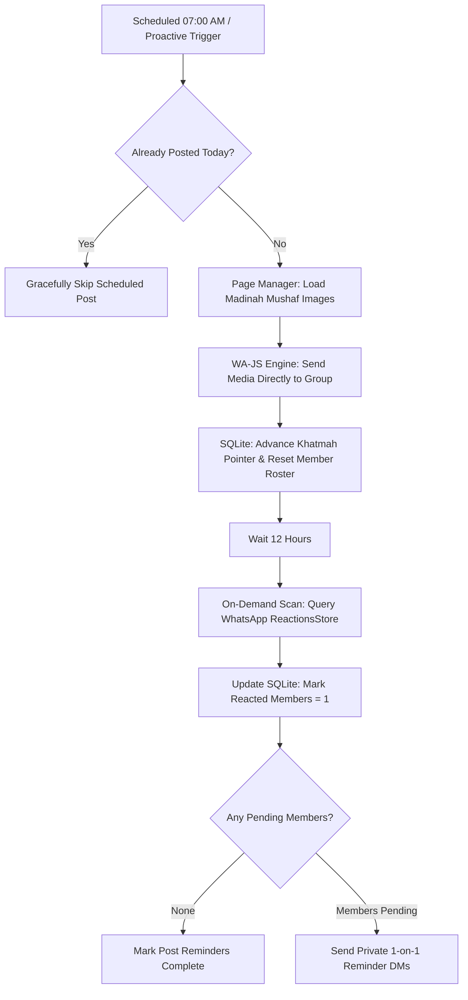

# 📖 Baba Quran (بابا قرآن)

An automated, stateful Python WhatsApp bot designed to manage daily family Quran Khatmah schedules, publish high-resolution Madinah Mushaf page images, track member emoji reactions on demand, and dispatch gentle private 12-hour reminder DMs.

---

## ⚡ Quick Start: Run the Bot in 3 Simple Steps

### 1️⃣ Step 1: Clone & Setup Environment
```bash
git clone https://github.com/muammera1/baba-quran.git
cd baba-quran

# Activate virtual environment
source .venv/bin/activate

# Install dependencies (first time only)
pip install -r requirements.txt
```

### 2️⃣ Step 2: Start the Background Service
```bash
./manage.sh start
```

### 3️⃣ Step 3: Open Dashboard & Link WhatsApp
1. Open your browser and go to: **[http://localhost:8080](http://localhost:8080)**
2. On your dedicated WhatsApp phone, open **WhatsApp ➔ Linked Devices ➔ Link a Device**.
3. Scan the QR code displayed on the screen.

🎉 **You're all set!** The session is saved locally. The bot will automatically publish the daily Quran pages to your group every morning and send 12-hour reminder DMs to members who haven't reacted.

---

## 🎮 Daily Usage & Commands

Manage everything with the simple `./manage.sh` CLI:

```bash
# 📖 Publish today's Quran reading immediately (proactive post)
./manage.sh post-now

# 🎚️ Set upcoming schedule starting page (e.g. start next at page 100)
./manage.sh set-page 100

# 👥 Sync family members and real phone numbers from WhatsApp
./manage.sh sync-members

# 📊 Check service status and active PID
./manage.sh status

# 📄 Stream live application logs
./manage.sh logs

# 🛑 Stop or restart the background daemon
./manage.sh restart
./manage.sh stop
```

---

## 🌐 Web Admin Dashboard

Access the full management interface at **[http://localhost:8080](http://localhost:8080)**:

- **📊 Overview Tab**: Visual Khatmah progress bar, interactive schedule starting page slider (1–604), instant "Post Now" button, and today's dispatch stats.
- **👥 Members & Reactions Tab**: Verified family contact names, formatted international phone numbers, real-time emoji reaction badges (`🙏`, `👍`, `❤️`), and reminder exemption toggles.
- **🕌 Surahs Tab**: Publish off-the-plan Surahs (e.g. Friday Surah Al-Kahf) anytime without disrupting the regular Khatmah sequence.
- **⚙️ Settings Tab**: Configure daily post time (default `07:00 AM`), pages per day (default `2`), reminder delays (default `12h`), and timezone.
- **📜 Logs Tab**: Live terminal output of bot operations.

---

## 🌟 How It Works (The 3-Step Daily Lifecycle)

```
[ 1. Morning Post (07:00 AM) ]
       │
       ▼
[ Dispatches 2 Mushaf Images ] ──► Posts to group via WA-JS API
       │                           Advances Khatmah pointer (e.g. Page 12 ➔ 14)
       ▼                           Resets daily member tracking table (reacted = 0)
   (12 Hours Window)
       │
       ▼
[ Pre-Reminder Reaction Scan ] ──► Scans group chat for emoji reactions (🙏, 👍, ❤️)
       │                           Marks completed members in SQLite (reacted = 1)
       ▼
[ Targeted Private Reminder DMs ]► Sends gentle 1-on-1 reminders ONLY to pending members
```

---

## 🔄 System Dataflow Architecture



---

## 📚 Technical Documentation & Specifications

- **[Master Architecture Plan (plan.md)](plan.md)**: System design and milestone tracker.
- **[Developer & Agent Guidelines (GEMINI.md)](GEMINI.md)**: Operational rules and coding constraints.
- **[REST API Specification (docs/api.md)](docs/api.md)**: Complete catalog of backend endpoints.
- **[ADR-001: WA-JS Injected Media Dispatch](docs/adr/001-wajs-media-dispatch.md)**: Why direct WA-JS API is mandatory over DOM emulation.
- **[ADR-002: On-Demand Reactions via ReactionsStore](docs/adr/002-on-demand-reactions.md)**: Why on-demand batch scanning replaced continuous listeners.
- **[ADR-003: Linux / WSL Environment Isolation](docs/adr/003-linux-wsl-isolation.md)**: Linux native isolation & singleton browser locking.
- **[Database Schema DDL (data/db/schema.sql)](data/db/schema.sql)**: Master SQLite schema.

---

## 🧪 Automated Testing

Run the full unit test suite:
```bash
python3 -m unittest discover tests
```
