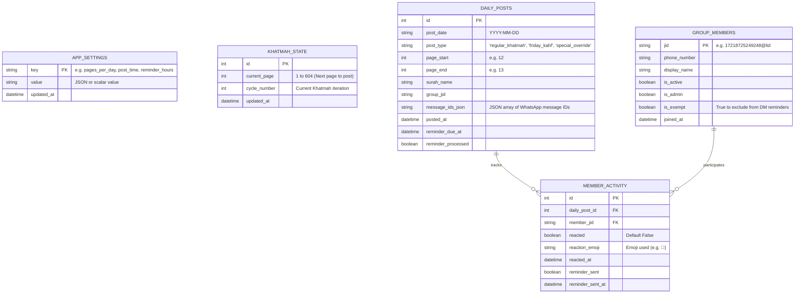

# Master Architecture & Implementation Plan: Baba Quran Bot

## 1. Project Overview & Architecture
**Baba Quran** is an automated, stateful Python application that manages daily Quran reading schedules, posts page images to a WhatsApp group, tracks member emoji reactions on-demand, and sends private DM reminders to members who have not reacted within 12 hours.

### Key Capabilities:
1. **Configurable Daily Quran Posting**:
   - Posts a configurable number of pages daily (default: 2 pages at 07:00 AM Makkah time).
   - Pages `1` through `604` (Madinah Tajweed Mushaf) stored locally in `data/pages/`.
   - Seamless Khatmah rollover (604 ➔ 1) with complete reading history in SQLite (`data/db/baba_quran.db`).
2. **Direct WhatsApp Web API Engine (WA-JS / WPPConnect)**:
   - Built on a persistent headless Playwright context in `data/session/playwright_wa/`.
   - Injects the battle-tested `wppconnect-wa.js` bridge directly into WhatsApp Web's internal Webpack modules.
   - Programmatically uploads and sends Quran page images via `WPP.chat.sendFileMessage(jid, dataUrl, { type: 'image', caption, filename })` with zero reliance on fragile UI clicking.
3. **Deterministic On-Demand Reaction Detection**:
   - **Post Initialization**: Immediately upon publishing a new daily post, a clean tracking roster is initialized in SQLite (`reacted = 0` for all active members).
   - **On-Demand Pre-Reminder Scan**: Exactly before the 12-hour reminder routine runs (or upon manual refresh), the bot queries WhatsApp Web's `ReactionsStore` (`rEntry.reactions[].senders[].senderUserJid`) to extract all member emoji reactions on the active post and updates SQLite.
   - **Targeted Reminders**: Private WhatsApp DMs are dispatched strictly to members where `reacted = 0`. No unnecessary 24/7 background listener overhead.
4. **Proactive Manual Posting with Automatic Schedule Skip**:
   - The Admin can proactively post today's Quran reading at any time via the Web Dashboard (**"نشر ورد اليوم فوراً"**) or CLI (`python3 scripts/post_now.py`).
   - When triggered proactively, the post is published, the Khatmah pointer advances, and today's date (`YYYY-MM-DD`) is recorded in SQLite.
   - The scheduled morning job (07:00 AM) automatically inspects SQLite: if today's post was already executed proactively, it **gracefully skips posting again** to prevent duplicate messages.
5. **Interactive Schedule Start Page Slider**:
   - Admin has full control to slide or set the upcoming schedule starting page (1 to 604) with live Surah and Juz preview on the Web Dashboard and via CLI (`python3 scripts/set_page.py <page>`).
6. **12-Hour Private Reminder Engine**:
   - Automated background job queries SQLite for members who have not reacted 12 hours after dispatch.
   - Sends gentle, personalized private WhatsApp DMs via `WPP.chat.sendTextMessage`.
7. **Off-the-Plan & Special Overrides**:
   - Friday Surah Al-Kahf (Pages 293–304) and ad-hoc Surah posts without breaking the regular Khatmah progression.
8. **Web Admin Dashboard**:
   - Zero-dependency HTTP Web Server on `http://localhost:8080` with a responsive Arabic Tailwind UI.
   - Interactive page slider, live reaction scanner, member roster management, off-the-plan Surah sender, and real-time logs.

---

## 2. Directory Structure

```
baba-quran/
├── config/                       # Settings & templates
│   └── settings.yaml             # Configurable times, pages_per_day, and templates
├── data/                         # Local persistent data
│   ├── db/                       # SQLite database
│   │   └── baba_quran.db
│   ├── pages/                    # 604 Quran page images (1.png to 604.png)
│   └── session/                  # WhatsApp Web credentials & QR capture
│       └── playwright_wa/        # Headless Chromium user data directory
├── src/                          # Application source code
│   ├── core/                     # Database, config loader, logging, models
│   │   ├── config.py
│   │   ├── database.py
│   │   ├── logger.py
│   │   └── models.py
│   ├── quran/                    # Quran metadata, page selector, and overrides
│   │   ├── metadata.py           # 114 Surahs, page ranges, Juz mappings
│   │   ├── page_manager.py
│   │   └── special_schedules.py
│   ├── whatsapp/                 # WhatsApp API integration layer
│   │   ├── client.py             # WhatsApp client facade
│   │   ├── message_builder.py    # Arabic text builder
│   │   ├── playwright_client.py  # WA-JS Playwright API driver
│   │   └── wppconnect-wa.js      # Bundled WA-JS bridge script
│   ├── scheduler/                # APScheduler job definitions
│   │   ├── jobs.py
│   │   └── scheduler.py
│   ├── web/                      # Web Admin Dashboard
│   │   ├── server.py             # REST API & static file HTTP server
│   │   └── templates/
│   │       └── index.html        # Arabic UI dashboard
│   └── main.py                   # CLI daemon entrypoint
├── scripts/                      # Setup and management utilities
│   ├── set_page.py               # Set upcoming schedule starting page (1-604)
│   ├── post_now.py               # Proactively execute daily post immediately
│   ├── download_pages.py         # Quran image downloader
│   └── sync_members.py           # Member sync utility
├── tests/                        # Pytest automated test suite (100% passing)
├── manage.sh                     # Service manager (start, stop, restart, status, logs)
├── GEMINI.md                     # Agent developer guidelines
├── plan.md                       # Master Architecture & Implementation Plan
└── requirements.txt              # Python dependencies
```

---

## 3. Database Schema (SQLite)



---

## 4. WhatsApp Web & Reaction Integration

### Operational Pipeline:
1. **Chat & Media Loading**:
   - The bot waits for `#pane-side` / chat list to ensure IndexedDB has hydrated.
   - Calls `await WPP.chat.find(jid)` and `await WPP.chat.openChatBottom(jid)` to ensure the chat model is loaded in `ChatStore`.
   - Sends image Base64 binaries via `WPP.chat.sendFileMessage()` returning verified server message IDs (`msgId`).
2. **Reaction Model Parsing**:
   - On-demand inspection uses `window.WPP.whatsapp.ReactionsStore.get(msgId)`.
   - Traverses `rEntry.reactions[].senders[]` extracting:
     - `senderUserJid`: The member JID (e.g. `17218725249248@lid`)
     - `reactionText`: The exact emoji (e.g. `🙏`, `👍`)
   - Updates `member_activity` in SQLite: `reacted = 1, reaction_emoji = '🙏', reacted_at = CURRENT_TIMESTAMP`.

---

## 5. Completed Work & Verified Components

| Milestone / Component | Status | Notes |
|---|---|---|
| **Quran Asset Cache** | ✅ Complete | 604 Madinah Tajweed pages (`1.png` to `604.png`) cached locally in `data/pages/`. |
| **SQLite Core & Models** | ✅ Complete | Database initialized with WAL mode, state tracking, and settings manager. |
| **WA-JS API Engine** | ✅ Complete | Direct media dispatch & reaction hooks verified with live server message ACKs. |
| **Live WhatsApp Group Verified** | ✅ Complete | Delivered directly to **"ختمة ابراهيم معمر رحمه الله"** (`120363429851468692@g.us`). |
| **Group Roster Sync** | ✅ Complete | Synced all 7 real family members with names and admin badges. |
| **Manual Starting Page Slider** | ✅ Complete | Interactive slider (1-604) and CLI `scripts/set_page.py` verified. |
| **Proactive Posting & Auto-Skip** | ✅ Complete | Instant posting with automatic duplicate skip on scheduled morning runs. |
| **On-Demand Reaction Engine** | ✅ Complete | Exact `ReactionsStore` sender extraction verified live with member reaction (`🙏`). |
| **Web Admin Dashboard** | ✅ Complete | Accessible at `http://localhost:8080` with Arabic UI, slider, and live logs. |
| **Daemon Management** | ✅ Complete | `./manage.sh {start|stop|restart|status|logs}` manages the background service smoothly. |

---

## 6. Service Management Commands

```bash
# Activate environment
source /home/ahmadm/projects/baba-quran/.venv/bin/activate

# Service lifecycle
./manage.sh start      # Start background bot & web admin
./manage.sh status     # Check running state & PID
./manage.sh logs       # Tail live logs
./manage.sh restart    # Restart service after code changes
./manage.sh stop       # Stop service cleanly

# Admin CLI Commands
python3 scripts/set_page.py 100   # Set next schedule to start on Page 100
python3 scripts/post_now.py       # Proactively post daily pages immediately
```

---

## 7. Upcoming Enhancements
- [ ] **Dedicated Duaa Feature for Father ("الحاج إبراهيم معمر رحمه الله")**:
  - Automatically attach a rotating or customizable prayer/Duaa to daily posts and Friday Khatmah summaries (deferred by user for a later milestone).
- [ ] **Automated Weekly Khatmah Recap**:
  - Summary post every Thursday evening showing group completion rates and cheering members.
